<h1 align="center">Hi, I'm Aidan Keighron</h1>

💼 Founded **[Half Full](https://www.halffull.pro/)**: A productivity software that lets you write down your tasks as quickly as you can think of them

⚒️ Co-Building **[2-Week Projects](https://aidankeighron.github.io/educational-website/)**: An educational platform that gives you real experience by having you work on real projects

🤖 Team Principal at **[Bad Conflict](https://www.aidankeighron.dev/combat-robotics)**: Combat robotics team competing in Antweight compeitions

💡 On a quest to always learn new things

<h2 align="center">Languages and Tools</h2>

<!--https://github.com/Ileriayo/markdown-badges!-->

<h2 align="center">Stats</h2>

  <!-- https://github.com/anuraghazra/github-readme-stats -->
  

<!--  !-->

  

